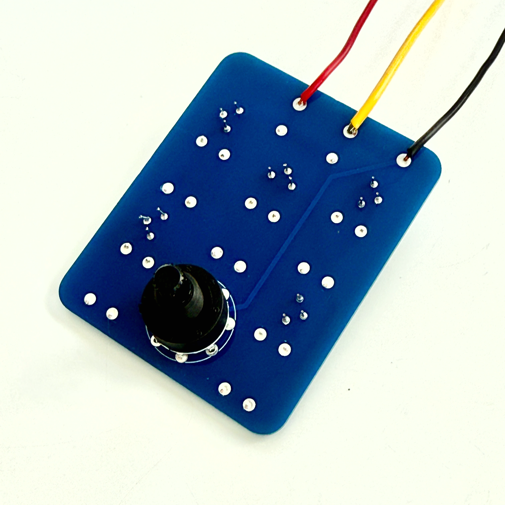

# Switchable Voltage Divider Box — Circuit Overview and Build Guide

This PCB implements a **switchable resistive voltage divider** intended to derive accurate, repeatable fractions of a stable DC reference (nominally 10 V). Each divider tap produces a fixed ratio of the input voltage, selectable via a 1-pole, 5-position rotary switch. 

The design is optimized for trimming resistance values to achieve (relatively) precise divider values.




## Circuit Description

There are five taps on the PCB. Each tap on the PCB has space for two resistors and a trim pot (Bourns 3362).

Each tap is a **two-resistance voltage divider**:

```
Vin ── Rtop ──┬── Vout
              |
            Rbottom
              |
             GND
```

**Rtop** is a fixed value for all taps. (I used 100k.)

**Rbottom** is implemented as:

* A fixed resistor
* A small trim potentiometer (Bourns 3362)
* Optional second series resistor or jumper

This arrangement allows:

* Coarse ratio setting with fixed resistors
* Fine trimming with a low-value trimmer
* Good long-term stability by minimizing the trimmer’s contribution to total resistance

The rotary switch selects which divider output is routed to the output jack.

### Divider Equation

The fundamental voltage divider relationship is:

```
Vout = Vin * (Rbottom / (Rtop + Rbottom))
```

To design a divider for a desired ratio:

```
k = Vout / Vin
```

Solve for the shunt resistor:

```
Rbottom = (k / (1 - k)) * Rtop
```

This PCB assumes:

```
Rtop = 100,000 ohms
```

---

### Example Divider Values 

Exact values matter. Let's say Rtop = 100,468 Ω.

| Divider ratio     | Vout (from 10V) | Rbottom (ideal) |
| ---- | --- | --- |
| 0.5               | 5.0 V          | 100,468 Ω          |
| 0.3               | 3.0 V          | 43,058 Ω        |
| 0.2               | 2.0 V          | 25,120 Ω        |
| 0.1               | 1.0 V          | 11,1163 Ω        |
| 0.01              | 0.1 V          | 1,015 Ω         |

In practice, these are realized using nearby standard values plus the trim pot to dial in the exact ratio.

You can, of course, use whatever ratios you like.

## Build Notes

The PCB is designed around a 1-pole 5-position (using 1P/8-pos form factor) like the one available from pedal parts supplier [Love My Switches](https://lovemyswitches.com/mini-rotary-switch-1p5t-1-pole-5-position-knurled-shaft/) or [PedalPCB](https://www.pedalpcb.com/product/mini-rotary-switch-1p5t/).

The PCB is also designed to fit within a standard 125B aluminum enclosure with room to install your choice of inputs and outputs (banana jacks, RCA, etc.).

## Build Instructions (Summary)

1. **Populate fixed resistors first**

   * Use precision metal film resistors where possible.
   * Keep resistor types consistent across all taps to improve ratio tempco matching.

2. **Install the trimmer (Bourns 3362)**

   * Use the trimmer only for fine adjustment.
   * Aim to keep it near mid-range once trimmed.

3. **Install jumpers or series resistors**

   * If a second resistor footprint is unused, install a jumper.
   * Otherwise, use it to reduce the trim range and improve stability.

4. **Clean the PCB**

   * Thoroughly remove flux residue, especially around the 0.01 tap.
   * Leakage dominates errors at low-voltage, high-impedance nodes.

5. **Trim each divider**

   * Apply a stable input voltage.
   * Measure Vin and Vout with the same DMM.
   * Adjust the trimmer until the ratio (Vout / Vin) matches the target value.

6. **Final assembly**

   * Mount the PCB and switch in a metal enclosure.
   * Keep wiring short and thermally uniform.

### Notes on Use

* Divider accuracy should be evaluated **ratiometrically**, not as an absolute voltage.
* The 0.01 tap is most sensitive to leakage, temperature gradients, and contamination.
* A metal enclosure significantly improves short-term stability and repeatability.

This design is intentionally simple, adjustable, and reproducible.
